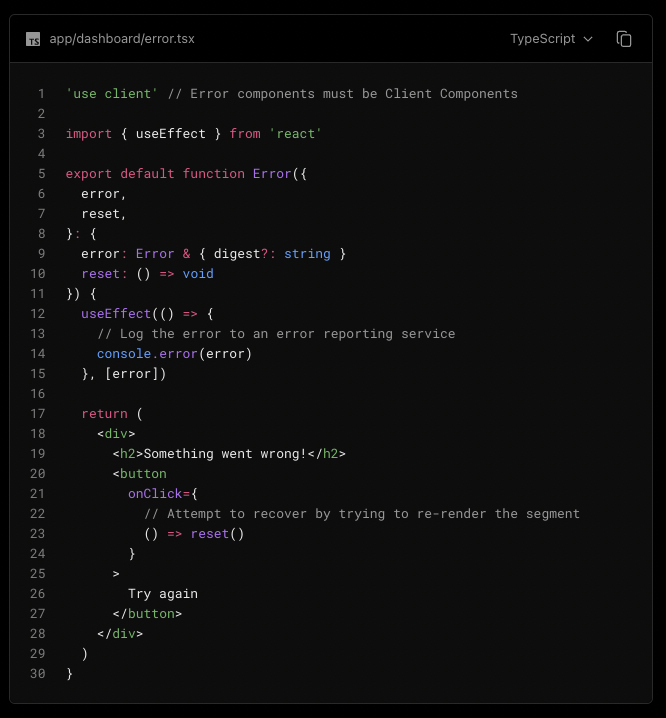

## next

1. next팀에서는 server components에서 왠만하면 데이터를 fetching을 선호한다. </br>
   이유:

   1. backend 리소스에 직접적으로 접근가능하다.
   2. token, key 같은 보안적인 요소를 클라이언트에 알려주지 않아도 된다.
   3. 클라이언트에서 데이터를 페칭, 렌더링하는 것을 서버에서도 같은 환경에서 할 수 있다.
   4. 서버-클라이언트-서버-클라이언트 이런 번거로운 데이터 페칭을 안해도 된다.

2. 중복되는 요청을 해도 next에서 자동응로 하나의 요청으로 만들어 준다.
   
   - post , patch 등 수정의 api는 제거를 제공하지 않습니다.

---

## version 12 / version 13 큰 차이점

### 12 version: 페이지 단위로 렌더링 방식을 규정

- getStaticProps.. 등등의 함수의 있는 코드는 server에서 실행된다.
- 나머지 함수는 클라이언트에서 실행된다.

### 13 version: react18 버전부터 Server Components을 규정 - 컴포넌트 단위로 렌더링 방식을 규정 할 수 있음 (app 폴더에 모든 컴포넌트는 기본적으로 서버 컴포넌트)

## Server-Components인지 Client-Components 확인 할 수 있는 방법 (보류)

---

## Server Components

- console.log을 찍어보게 되면 브라우저(개발자도구)에서 console.log가 찍히지 않는다.
- vscode 내에 있는 terminal에서 찍힌다.
  </br>
  이유: 서버에서 렌더링이 되어서 나오기 때문이다. (HTML형태로 받아온다.)
- 브라우저에서 제공하는 API을 사용 할 수 없다. (ex: localStroage, Intersection Observer)등
- 리액트에서 제공하는 useState을 이용한 상태관리를 할 수 없다.
- node 환경에서 제공하는 API을 사용 할 수 있다. (fs, os 사용 가능)

---

## Client Components

- 브라우저에서 제공하는 API을 사용 할 수 있다.
- 리액트에서 제공하는 useState을 사용해서 상태관리를 할 수 있다.
- next13 에서는 'use client'; 사용하여 클라이언트 컴포넌트로 전환할 수 있다.
- 예제: components - Counter.tsx
- 클라이언트 컴포넌트의 말은 무조건 클라이언트 사이드 렌더링이 된다는 얘기가 아니다.
- 서버에서 서버에서 pre 렌더가 되어 client에서 hydrated가 된다.
- 클라이언트 컴포넌트란: 사용자가 클릭하는 이벤트나, 브라우저에서 사용되어야 하는 코드를 클라이언트에서 처리한다는 개념이다.

---

## 동작원리


위의 사진은 yarn build 을 하게 나오면 나오는 정보이다. </br>
○ 정적인 페이지들의 대한 정보이다.</br>
● dynamic 라우터 페이지를 가르키는데 dynamic/0531 , dynamic/0313 페이지만은 정적으로 미리 만들어서 놓았다는 정보이다. </br>
(클라이언트/서버) 컴포넌트로 나누면 장점: 번들링이 작아진다.

## 메모

---

### 어떤 문제 때문에 React18 / next13 버전에서 왜 Server components 와 Client components 로 나누게 되었는지?

- 13 이전에는 페이지 단위로 렌더링이 결정 되었을 때 javascript로 번들링 되는 사이즈를 줄이기 위헤서 나오게 되었다. (성능이 더 좋아짐)

---

## Server Components vs Client Components 사용해야 하는 시기

### Server Components

- 보안적으로 이슈가 있을 때 (ex: API keys, access tokens, etc...)
- 서버에 많이 의존하고 있는 무거운 작업이 들어갈 때

### Client Components

- 사용자의 이벤트를 받아야 할 때
- 브라우저 API을 이용해야 할 때
- Hooks을 사용해야 할 때

### SSG (Static Site Generation)

- 렌더링 시기: build 될 때 한번만 실행이 됨 -> 서버 내부에서 데이터 변경되어도 변경이 안됨
- fetch로 새로운 데이터를 가져오더라도 build 시간에 한번만 가져오기 때문에 SSG는 빌드가 다시 되지 않는 한 새로운 데이터를 가져올 수 없다.
- cache: 'force-cache' 옵션은 영원히 캐시를 한다는걸 의미 SSG로 동작한다.

### ISR (Incremental Static Regeneration)

- revalidate을 이용하여 ISR 사용 가능하다.
- fetch 할 때는 option에서 revalidate 옵션을 사용하여 ISR을 사용 할 수 있다.

```
const revalidate = 10
```

- 10초마다 데이터 유효성을 다시 설정할 수 있다.
- 실험방법: yarn build -> yarn start -> data/example/data.json의 데이터를 바꿔본다.
- production과 똑같은 환경에서 테스트를 하고 싶다면 yarn build -> yarn start을 해줘야 한다.

### SSR (Server-Side Rendering)

- fetch의 revalidate 의 옵션을 0으로 주게 되면 SSR이 적용 된다.
- cache: 'no-store' 옵션을 지정해도 SSR처럼 동작을 한다.

### CSR (Client-side Rendering)

- client components 에서 fetch 후 state을 이용하여 쓰면 된다.

---

## Loading Components

- loading이라는 파일을 만들고 사용하면 된다.
  
  <br />

- loading의 동작방식은 react Suspense을 사용하는것과 같다.
  
  <br />

---

## Error Components

- Error 사용 폴더방식 - erorr.jsx
  

- Error에는 error, reset props을 받도록 되어있다.
  

- Error의 동작방식은 react ErrorBoundary 사용하는것과 같다.
  

- 해당 페이지의 Error 파일이 없다면 상위폴더로 올라가서 Error파일을 찾게 된다.
  

---

## Images Components

### Next Image 외부이미지 사용

- images의 width , height을 설정해줘야 한다.
- next.config.js에 이미지 사용에 대한 설정을 해줘야 한다.
- 사이즈를 미리 지정하기 때문에 Layout shift가 일어나지 않는다.

### Next Image의 장점

- Next Image을 사용하면 next 자체에서 image을 최적화를 해준다. (이미지 크기, 퀄리티)
- priority을 지정해주면 가장 먼저 해당 이미지를 다운로드 해준다.

---

## Next Font 장점

### @next/font

- next는 자동으로 self-hosting 되도록 만들어져있다.
- next 내부적으로 CSS - size-adjust 속성이 설정 되어있기 때문에 layout shift가 일어나지 않는다.
- Google Fonts 을 사용해도 Google Fonts에 요청하는게아닌 Next Server에 저장되어있기 때문에 자체적으로 제공 가능하다.
- Font는 최상위에서 정의해주는게 좋다.

## 

## Redirect

- 특정한 경로로 왔을 때 다른 경로로 설정해주는 것.
- next.config.js 파일에서 설정으로 redirect 설정해줄 수 있다.
  

```
import { redirect } from 'next/navigation'

redirect('경로')
```

사용이 가능하다.

---

## Rewrite

- 해당 destination의 url로 들어와야 하는 페이지들을
  source의 url 들어와도 똑같은 페이지를 보여주도록 하는 next.config.js 설정이다
  

---

## middleware

- 특정 url에서 미들웨어 작동할 수 있다.
- 로그인의 여부를 판단해서 redirect 시켜줄 수 있다.
- 등등.. 여러가지 기능이 가능하다.
  next middleware 공식 홈페이지 : https://nextjs.org/docs/app/building-your-application/routing/middleware
